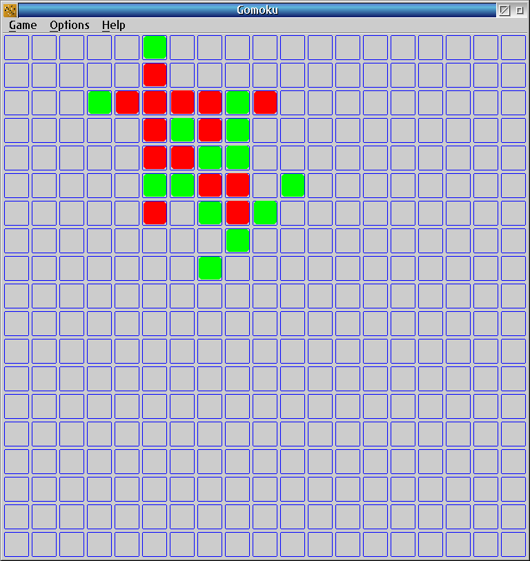

# Gomoku for OS/2

Five-in-a-row board game for OS/2 Presentation Manager.



**Version:** 1.2  
**License:** GNU GPL v3  
**Original author:** Jasper de Keijzer (1996)  
**OpenWatcom port:** OS2World (2026)

## Description

Play against the computer on a standard 19×19 board. Get five pieces in a row
(horizontal, vertical, or diagonal) to win.

You play Green. The computer plays Red and responds immediately after
each of your moves.

The interface is available in six languages: English, Spanish, Dutch, German,
French, and Italian. The selected language is saved automatically.

## Building

### OpenWatcom (recommended)

```
wmake -f makefile.wat
```

Or use the CMD script (produces `compile-wat.log`):

```
compile-wat.cmd
```

The EXE is produced at `bin\gomoku.exe`.

### Requirements

- OpenWatcom 1.9 or 2.0
- OS/2 Toolkit headers

## Directory Structure

```
GAME-BOARD-Gomoku\
  src\             OpenWatcom port source
  legacy\          Original ICC sources (preserved unchanged)
  bin\             Build output (git-ignored)
  doc\             Readme, Changelog, License
  makefile.wat     wmake build
  compile-wat.cmd  CMD build script with logging
```

## Keyboard Shortcuts

| Shortcut | Action |
|----------|--------|
| Ctrl+N   | New Game |
| Ctrl+X   | Exit |
| Ctrl+F   | Toggle Frame Controls (borderless mode) |

## History

See [doc/Changelog.txt](doc/Changelog.txt).

## License

GNU General Public License v3. See [doc/LICENSE.txt](doc/LICENSE.txt).

## Links

- https://www.os2world.com/games/index.php/native-games/board/133-gomoku
- https://github.com/OS2World/GAME-BOARD-Gomoku
